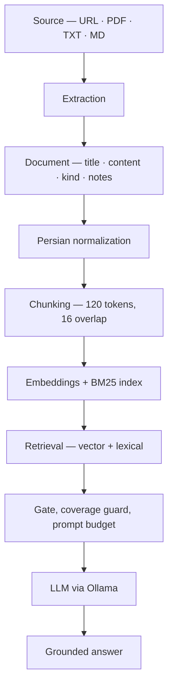

# Persian RAG


Grounded Persian question answering over **one document at a time** — a news URL, a PDF, a `.txt`, or a Markdown file. The document is extracted, normalized, chunked and indexed; answers are generated only from chunks retrieved out of that same document.

Everything runs locally. The embedding model runs on-device, the vector store is a local Chroma directory, and the LLM is served by [Ollama](https://ollama.com) on the same machine. No text leaves the machine.

> The user interface is in Persian, since that is the language the system is built to answer in. This README documents it in English.

---

## Contents

- [What makes it more than a RAG demo](#what-makes-it-more-than-a-rag-demo)
- [Results](#results)
- [Quick start](#quick-start)
- [Using it](#using-it)
- [How it works](#how-it-works)
- [Retrieval](#retrieval)
- [Answer policies](#answer-policies)
- [Evaluation](#evaluation)
- [PDF extraction](#pdf-extraction)
- [Project layout](#project-layout)
- [Configuration](#configuration)
- [Testing](#testing)
- [Limitations](#limitations)
- [License](#license)

---

## What makes it more than a RAG demo

Embedding a document and stuffing the nearest chunks into a prompt is the easy 20%. The parts that took the actual work:

**Hybrid retrieval with a guard against semantic false friends.** Cosine similarity alone will happily retrieve an unrelated chunk because it shares a polysemous word with the question. A BM25 channel runs alongside the vector channel, and a coverage check rejects vector hits that share no content word with the question at all.

**Retrieval depth and prompt budget are separate parameters.** They started as one knob, which meant searching deeper also meant flooding the prompt. Splitting them made a class of ranking failures diagnosable rather than invisible.

**PDF extraction reconstructs layout, not just text.** Reading order, columns, repeated headers and footers, broken paragraphs and simple tables are rebuilt from page geometry. Scanned pages with no text layer are detected and flagged.

**The evaluation harness explains failures instead of just counting them.** Retrieval misses are classified as `gate` (the right chunk was a candidate but the threshold rejected it) or `rank` (it never became a candidate) — a threshold problem and a ranking problem need opposite fixes. End-to-end misses are split into retrieval faults and generation faults, so a bad score points at a layer.

**A held-out evaluation set exists and is never used for tuning.** Every parameter in this README was chosen on the main set; the live set only reports whether those choices generalize.

**Source handling is pluggable.** Every input becomes a `Document` before the RAG layer sees it, so the retrieval logic has no idea whether it is reading a PDF or a news page. Adding a format means adding one adapter and registering a suffix.

---

## Results

Retrieval is measured offline against stored HTML fixtures — no network, no Ollama — so it can be rerun on every change. Answer quality needs a live model and is therefore slower and slightly non-deterministic.

| | Main set | Held-out set |
| --- | --- | --- |
| Questions (answerable / irrelevant) | 28 / 6 | 20 / 6 |
| Answer-bearing chunk retrieved | **25 / 28** (89%) | **19 / 20** (95%) |
| Irrelevant question given context | **0 / 18** (0%) | **1 / 18** (6%) |
| End-to-end correct answer (`strict`) | **22–23 / 28** (79–82%) | **16 / 20** (80%) |

Retrieval figures are deterministic. End-to-end answers are not: generation runs at `temperature: 0.3`, so the score moves between runs. Four runs of the main set scored 22, 22, 22 and 23 out of 28; three runs of the held-out set scored 16 / 20 every time. The range is reported rather than the best run.

The table reports `strict`, the default policy. The `open` policy scores 25 / 28 on the main set while still answering entirely from the document — see [Answer policies](#answer-policies).

Irrelevant questions are counted per article: 6 questions × 3 articles = 18 trials. A system that answers everything scores 18/18 here, so this column is the guard against a retriever that is merely generous.

The held-out set was written against three articles the parameters were never tuned on, and it is deliberately harder — one 112-chunk Wikipedia page is in it.

---

## Quick start

**Requirements:** Python 3.9+ (developed and tested on 3.9), ~450 MB of disk for the embedding model, and Ollama for generation. Identical on Windows, Linux and macOS apart from the virtualenv activation line.

**1. Environment and dependencies**

```bash
# Linux / macOS
python3 -m venv .venv
source .venv/bin/activate
python -m pip install --upgrade pip
python -m pip install -r requirements.txt
```

```powershell
# Windows (PowerShell)
py -3 -m venv .venv
.venv\Scripts\Activate.ps1
python -m pip install --upgrade pip
python -m pip install -r requirements.txt
```

PDF support is a separate, optional install. Skip it and URL, `.txt` and `.md`
ingestion work exactly as documented; PDF loading raises a clear error instead.

```bash
python -m pip install -r requirements-pdf.txt
```

> It is kept separate because it pulls in [PyMuPDF](https://pymupdf.readthedocs.io/),
> which is licensed under AGPL-3.0 or an Artifex commercial licence — unlike the
> rest of the dependency tree. See [License](#license).

**2. Local language model** — install [Ollama](https://ollama.com), then:

```bash
ollama serve
ollama pull qwen3:4b-instruct
```

**3. Run the tests** — no network, no Ollama, no prebuilt database required:

```bash
python -m pytest
```

**4. Run the app**

```bash
python -m news_qa
```

The first run downloads and caches the embedding model (~450 MB); later runs do not.

### Fully offline after the first run

The embedding library still contacts `huggingface.co` to check for a newer revision even when the model is cached. To skip that check:

```bash
HF_HUB_OFFLINE=1 python -m news_qa           # Linux / macOS
```

```powershell
$env:HF_HUB_OFFLINE = "1"; python -m news_qa  # Windows PowerShell
```

Chroma's anonymous usage ping is disabled in `news_qa/__init__.py`, before the `chromadb` import, so it never fires.

### Troubleshooting

| Symptom | Cause and fix |
| --- | --- |
| Startup hangs on "loading embedding model", then a `huggingface.co` error | The model is cached but the library is checking for a newer revision. Set `HF_HUB_OFFLINE=1`. |
| `❌ مدل زبانی در دسترس نیست` ("language model unavailable") | `ollama serve` is not running, or the model was never pulled: `ollama pull qwen3:4b-instruct`. |
| `pip install` fails while resolving dependencies | Upgrade pip first: `python -m pip install --upgrade pip`. |
| Persian output is mangled on Windows | The app reconfigures stdout to UTF-8 itself. If you are redirecting output, also set `PYTHONUTF8=1`. |

---

## Using it

```bash
python -m news_qa
```

The app asks for a source first:

```text
📥 منبع شما کدام است؟
  [۱] فایل محلی  — .markdown، .md، .pdf، .txt
  [۲] آدرس وب    — صفحهٔ یک خبر
```

After extraction it shows a preview — title, word count, and the first 240 characters — **before** anything is indexed. This step exists because extraction failures are silent otherwise: in one real test the selector for a news site returned the page's "contact us" block instead of the article, which the preview caught at 32 words.

A low word count raises a warning (120 words for web pages, 40 for files). The warning is about extraction quality only; it does not reject the document. For PDFs, pages with no selectable text are also counted, so scanned files are recognisable.

Then it asks for an answer policy, and you are in the question loop:

| Command | Effect |
| --- | --- |
| `خروج` / `exit` | Quit |
| `دیباگ` / `debug` | Toggle the retrieval inspector |
| `حالت` / `mode` | Switch answer policy |
| `راهنما` / `help` | Show commands |

Anything else is treated as a question.

`debug` prints every candidate with its distance, which channel produced it, and whether it was accepted, rejected by the threshold, rejected by the coverage guard, or trimmed by the prompt budget — plus a line explaining *why* when nothing survived.

---

## How it works



Normalization unifies Persian/Arabic digits and letter variants (`ي→ی`, `ك→ک`, `ة→ه`, …) and collapses whitespace, so the same word indexes and matches consistently.

Chunking is token-aware rather than character-aware: it splits on the embedding model's own tokenizer at `max_seq_length - 8` tokens with 16 tokens of overlap, preferring paragraph breaks, then line breaks, then sentence and clause boundaries in both scripts (`. `, `؟ `, `! `, `؛ `, `، `). The document title is prepended as its own chunk, because title-answerable questions are common and the title is often absent from the body.

---

## Retrieval

Two independent channels, then a merge.

**Vector channel** — cosine similarity between question and chunk embeddings via `paraphrase-multilingual-MiniLM-L12-v2`. Accepts candidates with distance ≤ `0.63`.

**Lexical channel** — a self-contained BM25 (`k1=1.5`, `b=0.75`) with a Persian stopword list and a ZWNJ-aware tokenizer. It catches exact names, numbers and rare phrases, which embeddings routinely blur. It can rescue a chunk the vector gate rejected, and can add up to 3 chunks the vector channel never proposed — but only if they score at least 35% of the best BM25 score *and* cover at least 35% of the question's weighted content words.

### The vector coverage guard

Semantic similarity alone lets a chunk in for sharing one ambiguous word. In one evaluation case, a question about a programming language pulled in an unrelated passage purely because both contained the Persian word *زبان* ("language" / "tongue"):

```text
vector distance : 0.550   (inside the 0.63 threshold)
BM25 score      : 0       (no content word in common)
```

So a vector hit must also have non-zero lexical coverage of the question. Raising that floor above zero was measured, and it only costs recall:

| Coverage floor | Answer-bearing chunk retrieved |
| --- | --- |
| **0.0** *(default)* | **25 / 28 — 89%** |
| 0.01 | 25 / 28 — 89% |
| 0.10 | 25 / 28 — 89% |
| 0.15 | 24 / 28 — 86% |
| 0.20 | 23 / 28 — 82% |
| 0.35 | 20 / 28 — 71% |

The floor ships at `0.0`, which means *strictly greater than zero* — share at least one weighted content word. A positive floor is not safe either: the lowest non-zero coverage observed on a correct chunk was `0.0071`, so even `0.01` would start cutting real signal. Rejected trials are shown rather than deleted, because "0.0 is the default" is a much weaker statement than "here is what 0.10 through 0.35 cost".

Disable the guard entirely with `--dense-coverage -1` on the evaluation tools.

### Depth versus budget

`CANDIDATE_POOL` (how deep to search) and `PROMPT_BUDGET` (how many chunks reach the model) used to be one parameter, so searching deeper also meant a noisier prompt.

The split was forced by a concrete failure: the correct chunk sat at distance `0.457` — comfortably inside the threshold — but at **rank 7**, so a depth of 3 never surfaced it. That is a ranking problem, and no threshold tuning can fix it.

Depth 8 was then evaluated properly:

| Setting | Retrieval, main | Retrieval, held-out | End-to-end, held-out |
| --- | --- | --- | --- |
| `pool=3, budget=6` *(default)* | 25 / 28 | 19 / 20 | 16 / 20 |
| `pool=8, budget=8` | 25 / 28 | **20 / 20** | 16 / 20 |

Depth 8 genuinely fixed the retrieval miss — and bought no additional correct answers. The fault classifier shows exactly what happened on the held-out set: retrieval faults went `1 → 0` while generation faults went `3 → 4`. The missing chunk did reach the model, and the model got it wrong anyway. The failure moved between layers instead of disappearing.

A wider pool that improves the retrieval metric without improving answers is not worth the extra context, so depth 8 was not adopted. The parameters stay independent so the tradeoff remains measurable — and this is the argument for splitting them: under a single knob, this experiment would have reported a better retrieval number and quietly hidden that no user-visible answer improved.

---

## Answer policies

The policy travels with each request (`rag.ask(question, resolve("open"))`), so one question's policy never leaks into the next.

**`strict`** *(default)* — answer only from retrieved text. If the document does not contain the answer, the model is instructed to say so verbatim rather than fall back on world knowledge. When nothing is retrieved, no prompt is built at all.

**`open`** — the document still comes first, but the model may fill gaps from its own knowledge, labelling each sentence `طبق متن خبر:` ("according to the article") or `خارج از متن خبر:` ("outside the article"). If retrieval returns nothing, the CLI asks for explicit confirmation before answering ungrounded.

On the main set, `open` measurably outperforms `strict` — and not by cheating:

| Policy | Correct | Retrieval faults | Generation faults | Ungrounded |
| --- | --- | --- | --- | --- |
| `strict` *(default)* | 22–23 / 28 | 3 | 2–3 | 0 |
| `open` | **25 / 28** | 3 | **0** | **0** |

The interesting column is the last one. An answer that is correct but carries the `خارج از متن خبر:` marker is scored as *ungrounded*, not correct — so `open` scoring 25/28 means it answered 25 questions **from the document**, and never once fell back on outside knowledge on this set. Its remaining 3 failures are the same retrieval misses `strict` has.

What actually differs is generation faults: 0 for `open` versus 2–3 for `strict`. On a handful of questions the correct text reached the model and the strict prompt still produced a refusal or a wrong answer. The stricter instruction makes the model more reluctant to commit to text it *was* given. That is a prompt-engineering cost, not a retrieval one, and it is the clearest open item in the project — `strict` remains the default because its guarantee is the point, but its prompt is leaving accuracy on the table.

The source markers are produced by the model, not enforced by the system. Nothing in the pipeline validates that a `طبق متن خبر:` sentence actually came from the retrieved text — treat the markers as a cooperating model's annotation, not a guarantee. Both runs of the table above scored identically, so these figures are stable despite the sampling temperature.

---

## Evaluation

```bash
python tools/eval_retrieval.py                      # offline, no Ollama
python tools/eval_retrieval.py --evalset live       # held-out set
python tools/eval_retrieval.py --threshold 0.75     # try a different gate
python tools/eval_retrieval.py --pool 8 --budget 8  # depth and budget together

python tools/eval_answers.py                        # end-to-end, needs Ollama
python tools/eval_answers.py --policy open
```

Both tools accept `--threshold`, `--pool`, `--budget`, `--coverage`, `--dense-coverage` and `--evalset`, so any number in this README can be reproduced or contradicted from the command line.

**Retrieval misses are classified by cause:**

| Cause | Meaning | Fix |
| --- | --- | --- |
| `gate` | The right chunk was among the candidates; the threshold rejected it. | Tune the threshold. |
| `rank` | The right chunk never reached the candidate pool. | Better retrieval — lexical channel, chunking, larger `--pool`. |

**End-to-end misses are split the same way** — retrieval fault (the text never reached the model) versus generation fault (it did, and the answer was still wrong). "Reached the model" means `in_prompt`, not merely `kept`: a chunk that passed the gate but was trimmed by the prompt budget did not reach the model and is counted as a retrieval fault.

If Ollama is unavailable, `eval_answers.py` stops and prints nothing rather than reporting a fabricated score.

---

## PDF extraction

A PDF is not a text file with decoration. Reading order, paragraphs, columns and headers have to be reconstructed from the geometry of the page.

PyMuPDF supplies raw spans only; those become internal `TextLine` objects, and all geometric reasoning lives in `sources/layout.py`, deliberately isolated from the extraction library. PyMuPDF is an optional dependency (`pip install -r requirements-pdf.txt`) and is imported lazily — nothing from it loads unless a PDF is actually opened. That module handles:

- right-to-left text and mixed RTL/LTR runs
- multi-column detection via gutter analysis (recursive, up to 3 levels)
- repeated headers and footers, removed only with enough evidence of repetition across pages
- paragraphs broken across lines, columns and pages
- simple table flattening
- pages with no text layer, detected and flagged for OCR

`tests/test_layout.py` covers this module with 37 tests, and `tests/test_pdf_roundtrip.py` compares extraction output against a recorded baseline:

```bash
python tools/regen_baseline.py            # show the diff against the baseline
python tools/regen_baseline.py --write    # record a new baseline
```

---

## Project layout

```text
news_qa/                  main package
├── __main__.py           entry point: python -m news_qa
├── cli.py                interactive loop and the debug view
├── normalize.py          Persian text normalization
├── document.py           the shared Document type and source errors
├── scraper.py            web page extraction
├── lexical.py            BM25 and lexical coverage
├── policy.py             prompts and answer policies
├── rag.py                chunking, embedding, retrieval, generation
└── sources/              source adapters
    ├── files.py          dispatch by file suffix
    ├── web.py            URL  → Document
    ├── pdf.py            PDF  → Document
    ├── plaintext.py      TXT/MD → Document
    └── layout.py         page geometry: reading order, columns, tables

tests/                    offline test suite (no network, no Ollama)
└── fixtures/             stored HTML, extraction baseline, evaluation sets
tools/                    evaluation and baseline-regeneration scripts
```

The RAG layer only ever sees a `Document` and cannot tell one source type from another. Supporting a new format means writing an adapter in `sources/` and registering its suffix in `files.py`.

---

## Configuration

Defaults live in `news_qa/rag.py` unless noted, and every one of them is a constructor argument on `PersianRAG` — nothing needs editing to experiment.

| Constant | Value | Meaning |
| --- | --- | --- |
| `RELEVANCE_THRESHOLD` | `0.63` | Maximum cosine distance for a vector hit |
| `CANDIDATE_POOL` | `3` | How deep the vector search goes |
| `PROMPT_BUDGET` | `6` | How many chunks may reach the model |
| `DENSE_COVERAGE_FLOOR` | `0.0` | Minimum question coverage for a vector hit |
| `LEXICAL_COVERAGE_FLOOR` | `0.35` | Minimum question coverage for a BM25 addition |
| `LEXICAL_SCORE_FLOOR` | `0.35` | BM25 score floor, as a fraction of the best hit |
| `MAX_LEXICAL_ADDITIONS` | `3` | Chunks BM25 may add on its own |
| `MAX_LEXICAL_CORPUS_CHUNKS` | `2000` | Above this, the lexical channel is skipped |
| `EMBEDDING_MODEL_NAME` | `paraphrase-multilingual-MiniLM-L12-v2` | ~450 MB, cached after first run |
| `THIN_ARTICLE_WORDS` *(scraper.py)* | `120` | Thin-extraction warning for web pages |
| `THIN_WORDS` *(sources/__init__.py)* | `40` | Thin-extraction warning for files |

### Model choice

`qwen3:4b-instruct` is the default. Against the thinking variant of Qwen3 on an informal 5-question probe, the instruct model was both faster and no less accurate:

| Model | Mean latency | Correct |
| --- | --- | --- |
| Qwen3 (thinking) | 68 s | 4 / 5 |
| `qwen3:4b-instruct` | 4 s | 5 / 5 |

Five questions is a sanity check, not a benchmark — but a 17× latency gap in an interactive tool settled it.

### Vector database

Chroma persists to `./chroma_db`, created relative to the working directory on first run. It is fully regenerable, is not source, and is gitignored. Deleting it breaks nothing. Tests use an in-memory client and never touch it.

---

## Testing

```bash
python -m pytest             # 270 tests, offline
python -m pytest -m endtoend # 5 more, requires Ollama
```

The default suite needs no network, no Ollama and no prebuilt database: web pages are stored as HTML fixtures and the vector store is built in memory. The 5 `endtoend` tests are marked and deselected by default precisely because they need a live model — keeping the fast suite runnable on every change.

| Area | Tests |
| --- | --- |
| Retrieval | 48 |
| Chunking | 37 |
| PDF layout | 37 |
| CLI | 35 |
| Sources | 34 |
| Normalization | 21 |
| Web scraping | 19 |
| BM25 / lexical | 15 |
| Answer policy | 10 |
| PDF roundtrip | 8 |
| Held-out eval set | 6 |

---

## Limitations

Stated plainly, because a known limitation is cheaper than a surprise.

**Retrieval.** Still weakest on name-centric questions and rare phrases when the correct chunk ranks low. All 3 remaining main-set misses are `rank` failures rather than `gate` failures, so no threshold setting recovers them. All 3 also come from a single interview article, where each answer (interviewee, reporter, occasion) sits in the news-agency byline and lede — editorial framing that shares almost no vocabulary with the questions asked about it.

**Web extraction.** Driven by a generic selector list (`article`, `.content`, `.post-content`, …) with a paragraph-based fallback. A site that restructures its HTML may need new selectors. `fetch` has a 15-second timeout but no retry, so one transient network error ends the attempt. `ollama.chat` has no timeout at all.

**PDFs.** Tables are flattened to plain text and merged-cell structure is lost. Formulas and charts that exist only as images need OCR, which is not implemented. Headers and footers are removed only with sufficient repetition evidence, so some survive. Multi-column documents with nested tables remain the hard case. Ordering of numbers and Latin phrases inside RTL text is improved but not solved — string joining is fixed, while fully reconstructing logical order from extraction output alone is not always possible.

**Scale.** Extraction is synchronous and in-process; a service deployment would want it on a queue. The lexical channel is skipped above 2000 chunks.

**Licensing.** This project is source-available, not open source — see [License](#license). PDF support is an optional extra because `pymupdf` is AGPL-licensed; the core install carries no copyleft dependencies.

**Dependency pinning.** `requirements.txt` is pinned to the exact versions the test suite is verified against. That buys reproducibility at the cost of staleness — the pins need periodic review for security updates.

---

## License

**Copyright © 2026 Amirsaedi. All rights reserved.**

This repository is **source-available**, not open source. The code is public so
it can be read, reviewed, and studied — as a portfolio piece and a reference
implementation. It is not licensed for reuse.

You may read the source and quote short excerpts with attribution. You may not
use, copy, modify, redistribute, or incorporate it into other work. See
[LICENSE](LICENSE) for the exact terms.

Pull requests are not accepted, since the licence provides no inbound
contribution terms. Issues and questions are welcome.

If you would like to use any part of this, ask — reach me at
<amirsaedi2010@gmail.com>.

### Third-party dependencies

Dependencies are installed from PyPI by the user and are governed by their own
licences, not this one. The core install is entirely permissive (MIT / BSD /
Apache-2.0), with `certifi` and `tqdm` under MPL-2.0 — file-level copyleft that
imposes nothing on this project.

PDF support is deliberately **not** part of the core install. It depends on
[PyMuPDF](https://pymupdf.readthedocs.io/), which is dual-licensed under
AGPL-3.0 or a commercial licence from Artifex. Installing it is your choice and
brings you under one of those two licences:

```bash
pip install -r requirements-pdf.txt   # optional, adds AGPL-3.0 PyMuPDF
```

Without it, URL, `.txt` and `.md` ingestion work exactly as documented — PDF
loading raises a clear error instead. Full attribution is in
[THIRD-PARTY-NOTICES.md](THIRD-PARTY-NOTICES.md).
